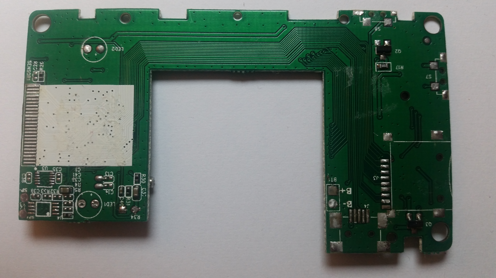
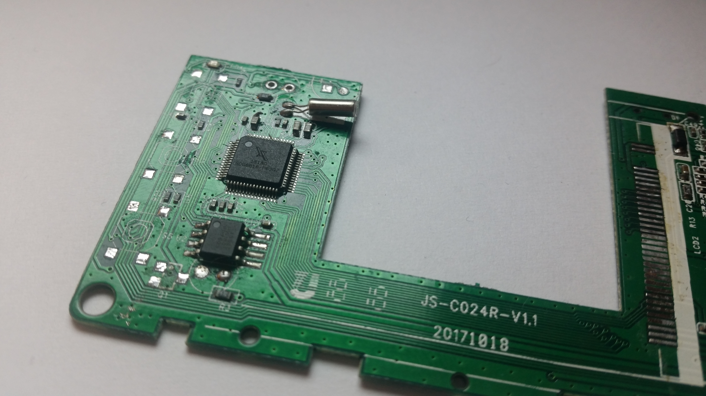
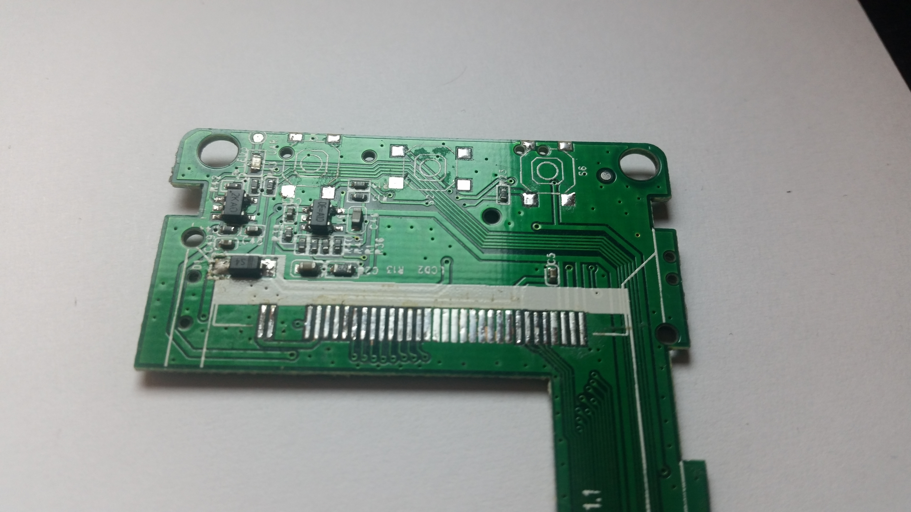

# RE: Dirt cheap second-hand broken DVR/dashcam

<table><tr>
  <td></td>
  <td></td>
  <td></td>
  <td></td>
  </tr><tr>
  <td align="middle"><i>Top</i></td>
  <td align="middle"><i>Bottom</i></td>
  <td align="middle"><i>CPU</i></td>
  <td align="middle"><i>Power</i></td>
</tr></table>

## Notes:
- When connected to a PC, the device is recognized as a webcam. Its name is shown as "TIGA Device" in the device manager.
- USB VID is 1908 (GEMBIRD) and PID is 3261 (nonexistent). AX2311, which has the PID 2311, has the same functionalities as the IC in this one. I guess 3261 may indicate that the IC is AX3261. The actual IC marking is 1818O BDG6816-P63QJ.
- The firmware has some strings referring to Buildwin (ex. BuildwinMedia-Player 1.00). When their website (www.buildwin.com) is visited, you will be welcomed by AppoTech Group. Their logo is also on the IC.
- Although it says it is an "HD 1080P" DVR, it uses a GC0309 8-bit parallel bus VGA camera sensor which has a limited maximum resolution of 640x480. I think there goes some horrible upscaling behind the scenes during recording.
- There is a button called S6 that I couldn't understand what its icon means _(lock? LED?)_. I put a question mark on its description in the schematic.
- Some resistors were immeasurable. I noted their values as UNK in the schematic.

## Stats:
- RE time: ~6 hours
- Schematic drawing time: ~10 hours
- Device price: US$1.1
