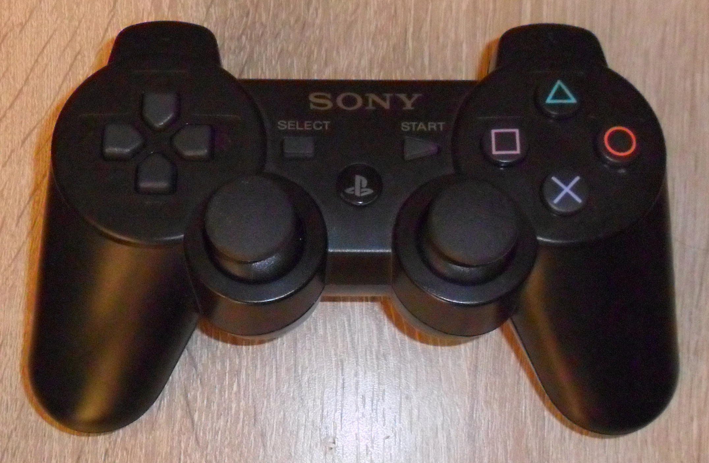
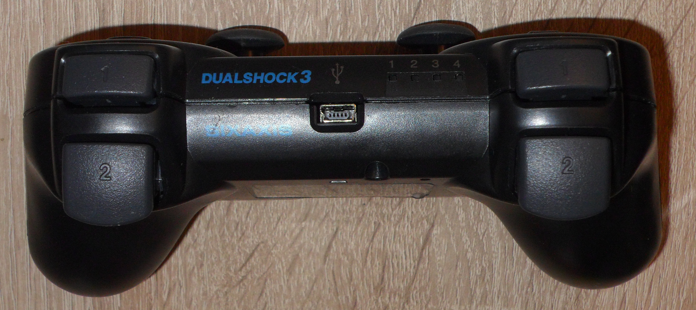

# RE: Bootleg PS3-compatible Dualshock 3 Sixaxis Controller with Bluetooth
_Notice: The `schematic.png` is in high resolution (11021x3986). You may need to download it._

<table><tr>
  <td></td>
  <td></td>
  <td></td>
  </tr><tr>
  <td align="middle"><i>Front</i></td>
  <td align="middle"><i>Back</i></td>
  <td align="middle"><i>Top</i></td>
  
</tr></table>

<table><tr>
  <td></td>
  <td></td>
  <td></td>
  
  </tr><tr>
  <td align="middle"><i>PCB with the battery taped on</i></td>
  <td align="middle"><i>Back of the PCB</i></td>
  <td align="middle"><i>Top of the PCB</i></td>
  
</tr></table>

## Notes:
- This is one of the most famous bootleg PlayStation controllers with the unique "entertain ment" typo on its label.
- I could not get the MCU <-> BT UART traffic and USB info since the device doesn't work.
- The contents of EEPROM are stored in the `eeprom.txt` file.  
    - There are only 6 bytes of data starting at address `0x10`, probably the MAC address of the Bluetooth (`00:1B:FB:D6:16:6E`).  
    - The rest are all `0xFF`s except `0x33` at address `0xFE` and `0x77` at address `0xA`.
- The system voltage is 3V instead of the typical 3.3V.

## Stats:
- RE time: ~10 hours
- Schematic drawing time: ~8 hours
- Device price: US$6.99 (back in 2019-2020)
